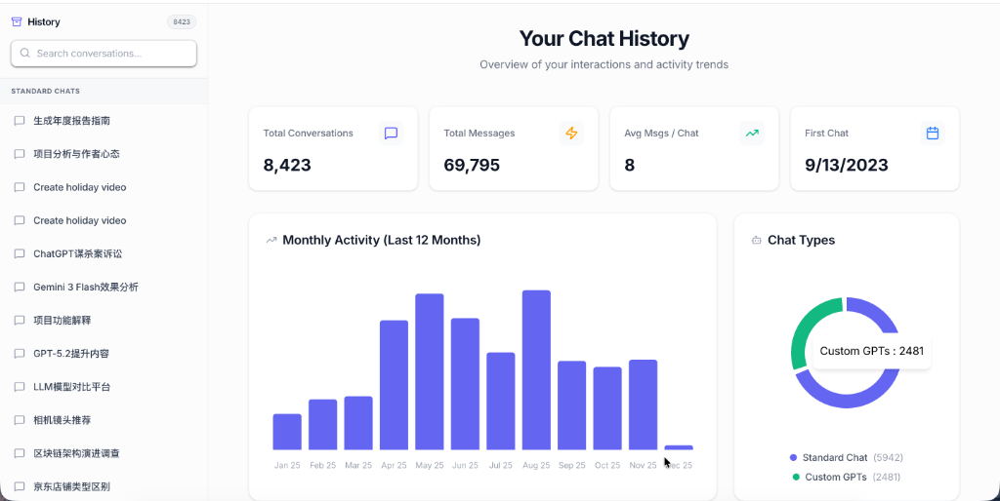

# ChatGPT Data Visualizer

A high-performance, privacy-first web application to visualize your ChatGPT history exports. Designed with a high-density "Data Style" layout for efficient browsing of large conversation logs.



## Features

- **Statistics Dashboard**: Visualize your chat habits with activity trends, message counts, and bot usage breakdown.
- **Premium UI**: Modern, glassmorphism-inspired design with refined typography (Inter & JetBrains Mono) and smooth animations.
- **Markdown & Code**: Full support for Markdown rendering, including syntax-highlighted code blocks, math equations, and lists.
- **High-Density Layout**: Optimized for reading large amounts of text with minimal wasted space.
- **Privacy First**: Runs entirely locally. Your data never leaves your machine.
- **Image Attachments**: Automatically displays images included in your export.
- **Instant Search**: Virtualized list allows instant filtering even with thousands of conversations.

## Prerequisites

- [Node.js](https://nodejs.org/) (v18 or higher)
- npm or yarn

## Usage Guide

### Method 1: Instant Drag & Drop (Recommended)

1. **Export Data**: Go to ChatGPT -> Settings -> Data controls -> Export data.
2. **Unzip**: Extract the downloaded zip file.
3. **Run App**:
   ```bash
   npm install
   npm run dev
   ```
4. **Drag & Drop**: Open [http://localhost:5173](http://localhost:5173) and drop your `conversations.json` file onto the window.

### Method 2: Legacy (Auto-load)

To have your data load automatically every time:

1. Create `public/data/` directory.
2. Copy `conversations.json` and any images (`file-*.png`) into `public/data/`.
3. Run the app, and it will skip the upload screen.

### Running the Application

1. Install dependencies:
   ```bash
   npm install
   ```

2. Start the development server:
   ```bash
   npm run dev
   ```

3. Open your browser and visit: [http://localhost:5173](http://localhost:5173)

## Building for Production

To create a standalone static build (e.g., for deployment to a private server):

```bash
npm run build
npm run preview
```

The build artifacts will be in the `dist/` directory.

## Troubleshooting

- **Images not loading?** Ensure the image files (starting with `file-`) are in the root of `public/data/` alongside `conversations.json`.
- **Blank screen?** Check the browser console (F12) for errors. Ensure `public/data/conversations.json` exists and is valid JSON.

